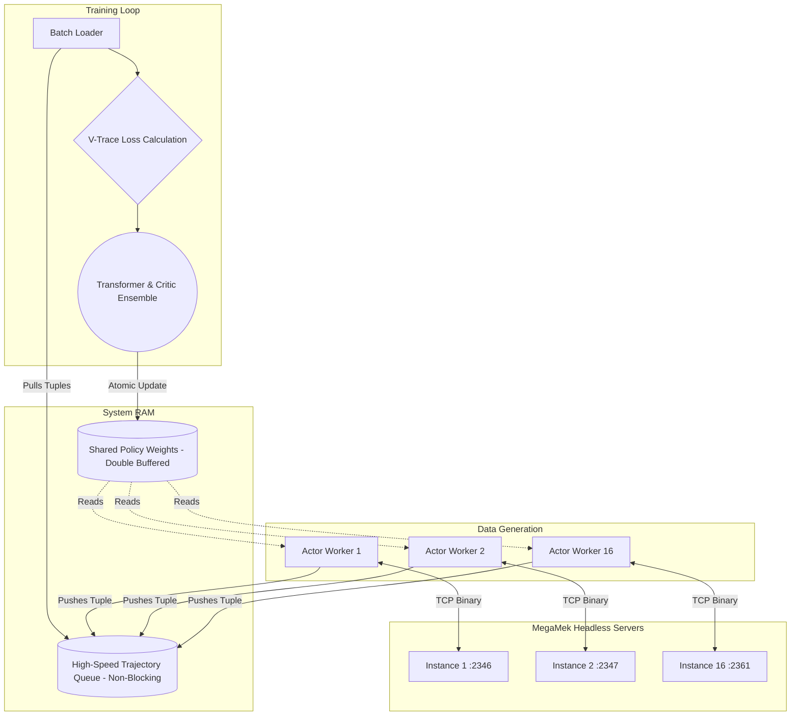

# BattleTech RL AI: System Design & Implementation


## 1. System Architecture Overview
The system utilizes a localized, asynchronous client-server architecture based on IMPALA. It is designed specifically to saturate high-end consumer desktop hardware (e.g., 8-core CPU, high-VRAM GPU) by decoupling the slow Java tabletop simulation from the lightning-fast GPU tensor calculations.





## 2. Component Specifications


### 2.1 The MegaMek Server (Java Backend)
* **Execution:** Run locally in headless mode (`java -jar MegaMek.jar -dedicated -port XXXX`). Up to 16 instances are spawned on incrementing port numbers.
* **The API Contract:** A custom Java plugin intercepts the game loop at the start of every actionable phase and emits a flattened state payload over the TCP socket. It then blocks, waiting for a valid action response.
* **The Checkpoint/Restore Protocol:** Exposes endpoints to save the board state to a byte array and instantly restore it, bypassing the standard XML save-file system for low-latency MCTS simulations (if utilized).


### 2.2 The Python Actors (CPU Workers)
* **Hardware Fencing:** To prevent CUDA context-switching bottlenecks and OOM errors, the 16 Actors are strictly fenced to the CPU. The CPU handles all environment stepping and behavior policy inference, reserving the GPU entirely for Learner backpropagation.
* **Execution:** 16 independent Python processes managed via `multiprocessing`. Each process maintains a dedicated, persistent TCP socket connection to a single MegaMek instance.
* **Behavior Policy ($\mu$):** Each Actor holds a slightly delayed, strictly CPU-bound copy of the neural network weights. When it receives a state from MegaMek, it performs a fast CPU inference to sample an action.
* **Deadlock-Safe Queueing:** Once the action is resolved, the Actor attempts a **non-blocking put** (`queue.put_nowait()`) of the transition tuple into the High-Speed Trajectory Queue. If the queue is saturated (i.e., the Learner is bottlenecked), the Actor intentionally drops the trajectory and continues stepping the environment. This strictly prevents producer-consumer deadlocks from cascading and crashing the training loop.


### 2.3 The Learner (GPU Orchestrator)
* **Execution:** A single, high-priority process controlling the main PyTorch model strictly on the GPU.
* **The Training Loop:** It continuously pulls mini-batches of trajectories from the Queue. Because the trajectories were generated by older Actor weights, the Learner applies V-trace clipping to calculate the mathematically safe gradients.
* **Atomic Weight Broadcast:** After every gradient update, the Learner pushes its new weights to the Shared Policy Weights block. To prevent read/write corruption crashes, the system uses a `multiprocessing.Lock` or a double-buffer system, ensuring Actors only pull cleanly swapped `state_dict` objects.


## 3. Data Payload Structures
*(Note: While represented conceptually as JSON below for readability, all payloads over the TCP socket are serialized strictly as binary formats, such as **MessagePack** or **Protocol Buffers**, to eliminate string-parsing overhead at high frequencies).*


### 3.1 The State Payload ($s$)
Emitted by MegaMek. Extracted into the $W \times H \times C$ tensor.
```json
{
  "phase_vector": {"main": 4, "sub": 0, "active_player": 1, "turn": 5, "obj_score": [12, 5]},
  "hexes": [...],
  "entities": [...]
}
```


### 3.2 The Hierarchical Action Mask (`action_mask_tree`)
Emitted by MegaMek alongside the state. To support autoregressive sampling, the mask must be a tree that defines legal subsequent tokens based on the current selection.
```json
{
  "unit_652": {
    "valid_targets": {
      "target_12": ["weapon_1", "weapon_2"],
      "target_84": ["weapon_1"]
    }
  }
}
```
*Implementation Note: The Python wrapper traverses this dictionary as the Transformer generates each token, dynamically zeroing out the logits of illegal branches before the softmax is applied.*


### 3.3 The Action Payload ($a$)
Emitted by the Python Actor. Sent over TCP to MegaMek. To ensure PyTorch can easily stack batches and compute token log-probabilities, the action sequence must be a strictly flat array of discrete tokens.
```json
{
  "command": "WEAPON_ATTACK",
  "sequence": [
    {"token_type": "UNIT", "id": 652},
    {"token_type": "TARGET", "id": 12},
    {"token_type": "WEAPON", "id": 1},
    {"token_type": "WEAPON", "id": 2},
    {"token_type": "CONTROL", "id": "STOP"}
  ]
}
```


## 4. Hardware Optimization Details (Desktop Target)
* **High-Speed Serialization:** Standard JSON serialization over local loopback connections introduces unacceptable latency when operating 16 concurrent engines. The architecture enforces binary serialization (e.g., Protobuf or MessagePack) to minimize the Java/Python handoff time.
* **IPC Framework:** Due to the massive data throughput, standard Python `multiprocessing.Queue` may bottleneck due to pickling overhead. The architecture assumes the use of a high-performance IPC library (e.g., `faster-fifo`, PyZMQ, or a local Redis instance) to handle the trajectory pushing.
* **Memory Limits & Non-Blocking Puts:** The Trajectory Queue must be strictly bounded (e.g., `maxsize=10000`) to prevent Out-Of-Memory (OOM) crashes in system RAM. The integration of non-blocking writes guarantees that the simulation cycle speed never outpaces available memory, trading occasional data loss for absolute system stability.
